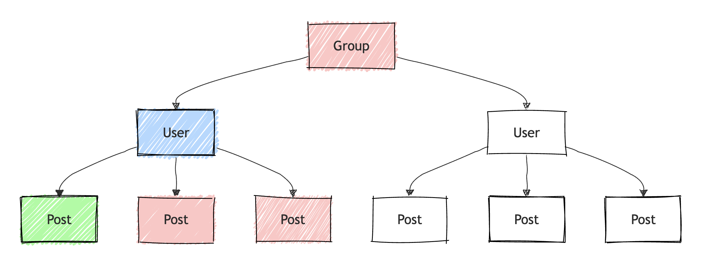
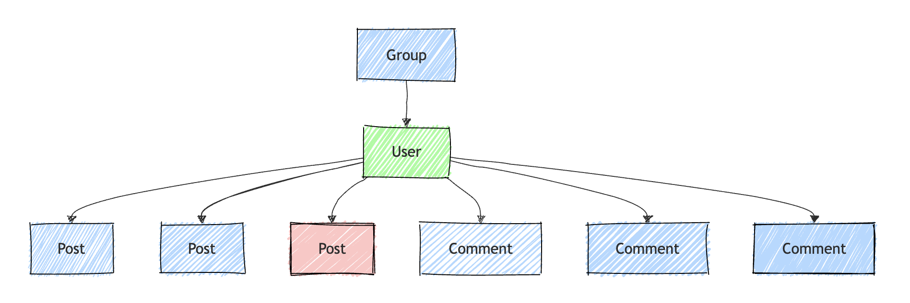

# Configuration

AliceGenerator provides a comprehensive set of configuration options to tailor fixture generation.

## Generator Setup

By default, you can create a `FixtureGenerator` in one line:

```php
use Solitus0\AliceGenerator\Generator\FixtureGeneratorBuilder;

$generator = FixtureGeneratorBuilder::create()->build();
```

### Doctrine Integration

To integrate with Doctrine and leverage entity metadata and proxies:

```php
use Solitus0\AliceGenerator\Generator\FixtureGeneratorBuilder;
use Solitus0\AliceGenerator\MetadataHandler\DoctrineMetadataHandler;

$generator = FixtureGeneratorBuilder::create()
    ->setMetadataHandler(new DoctrineMetadataHandler($entityManager))
    ->build();
```

The `DoctrineMetadataHandler` automatically:
- Excludes identifiers and unmapped properties from fixtures
- Handles Doctrine proxy objects
- Persists only managed entities

## Naming Strategies

Customize property and reference naming for your fixtures.

### Property Namer

By default, fixture property names match object properties. To use a custom property namer:

```php
use Solitus0\AliceGenerator\Generator\FixtureGeneratorBuilder;
use App\Alice\Naming\CustomPropertyNamer;

$generator = FixtureGeneratorBuilder::create()
    ->setPropertyNamer(new CustomPropertyNamer())
    ->build();
```

### Reference Namer

Reference keys used in generated fixtures (e.g., `@User-1`) are created by a **Reference Namer**.

You can configure a custom reference namer in the fixture generation context:

```php
$context = FixtureGenerationContext::create()
    ->setReferenceNamer(new ClassNamer());
```

Available Reference Namers
•	ClassNamer (default): Generates references based on the object’s class name and a numeric index, e.g., @User-1, @Product-42.

Reference namers allow you to customize how references are structured in the fixture files. This is useful when you want predictable keys or need to avoid naming conflicts across files.

## Strict Type Checking

By default, properties with default values are skipped using strict comparison (`===`). To disable strict type checking and use non-strict comparison (`==`) for non-null, non-boolean, non-object values:

```php
$generator = FixtureGeneratorBuilder::create()
    ->setStrictTypeChecking(false)
    ->build();
```

## Skipping Non-Writable Properties

By default, all object properties are considered for fixture generation. However, you may want to exclude properties that are not writable via Symfony's `PropertyAccessor` (e.g., private or read-only properties without setters).

To skip such properties during fixture generation, enable the `skipNonWritableProperties` flag in the context:

```php
$context = FixtureGenerationContext::create()
    ->setSkipNonWritableProperties(true);
```

## Output Format

Fixtures are generated in YAML by default. To output PHP code or a custom format:

```php
use Solitus0\AliceGenerator\Generator\PhpGenerator;
use Solitus0\AliceGenerator\Generator\FixtureGeneratorBuilder;

$generator = FixtureGeneratorBuilder::create()
    ->setGenerator(new PhpGenerator())
    ->build();

$code = $generator->generate($objects, FixtureGenerationContext::create());
```

## Generation Context

Use `FixtureGenerationContext` to control how `generate()` processes each request:

```php
use Solitus0\AliceGenerator\Generator\FixtureGenerationContext;

$context = FixtureGenerationContext::create();
```

### Recursion Control

### Legend

| Color / Style   | Meaning                | CSS Style           |
|-----------------|------------------------|---------------------|
| 🟩 Green        | Passed to generator    | `fill: #aaffaa`     |
| 🟦 Blue         | Included via traversal | `fill: #bbddff`     |
| 🟥 Red          | Excluded               | `fill: #ffcccc`     |
| ⬜ White         | Not visited            | `fill: #ffffff`     |
| 🔲 Thick border | Constrained            | `stroke-width: 4px` |

Limit how deep AliceGenerator traverses object graphs:

```php
$context->setMaximumRecursion(0);
```


```php
$context->setMaximumRecursion(1);
```


```php
$context->setMaximumRecursion(2);
```


Constrain generation to specific root objects:

```php
$context->addPersistedObjectConstraint($user);
```


```php
$context->addPersistedObjectConstraint([$post1, $post2]);
```


### Collection Handling

Control which collections and items are included:

Skip entire collections for owner classes:

```php
$context->addOwnersWithSkippedCollections(User::class);
```


Skip individual items via a callback:

```php
$context->addCollectionItemSkipCondition(
    function (string $ownerClass, $item) {
        return $item instanceof Post && $item->isDraft();
    }
);
```


Limit the number of items in a collection:

```php
$context->addCollectionItemLimitPerOwner(User::class, 3);
```


```php
$context->addLimitForOwnerItemCollection(User::class, Post::class, 2);
```


### Default Values and Sorting

Include properties with default values:

```php
$context->setExcludeDefaultValues(false);
```

Sort fixtures for deterministic output:

```php
$context->setSortResults(true);
```

## Custom Object Handlers

To support custom types (e.g., DateTime, UUIDs), see the [Custom Object Handlers](custom-object-handlers.md) guide.